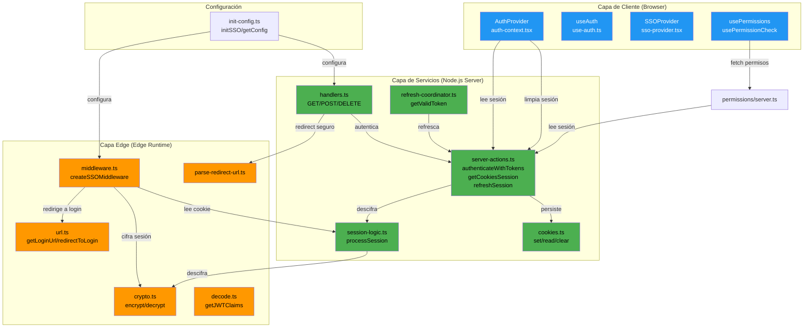
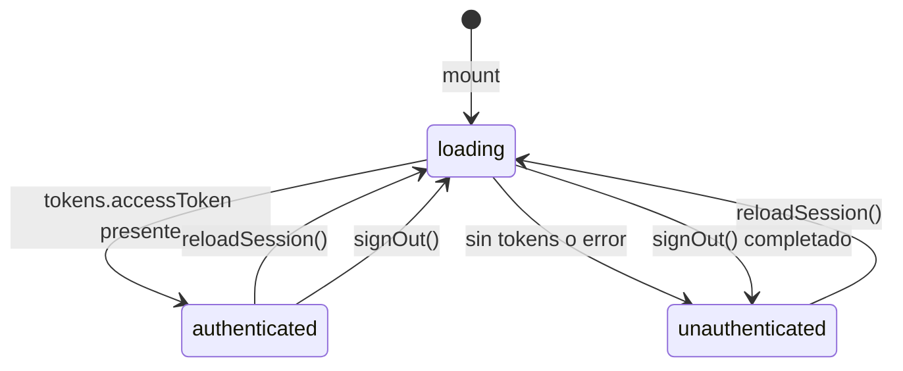
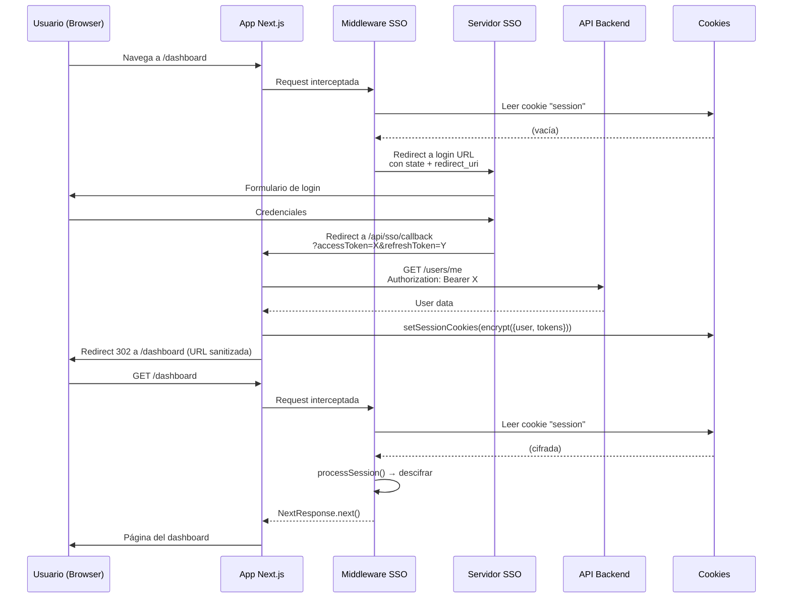
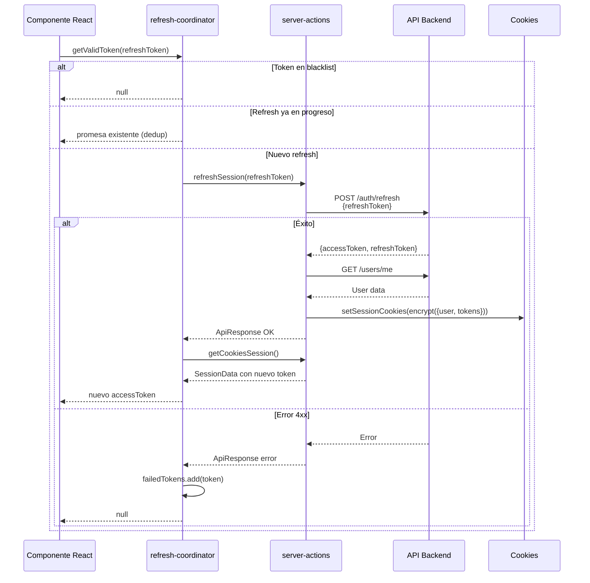
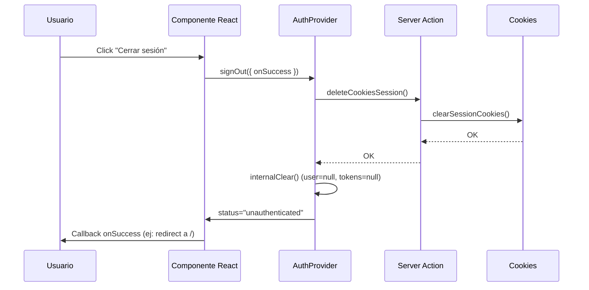
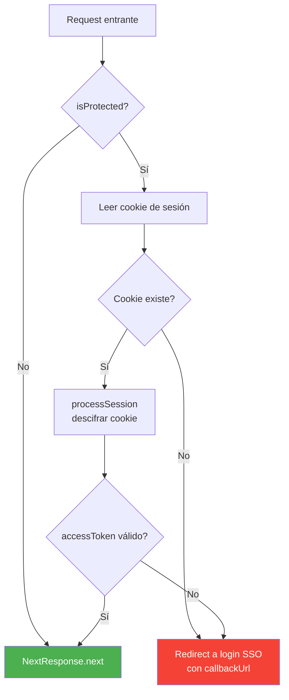
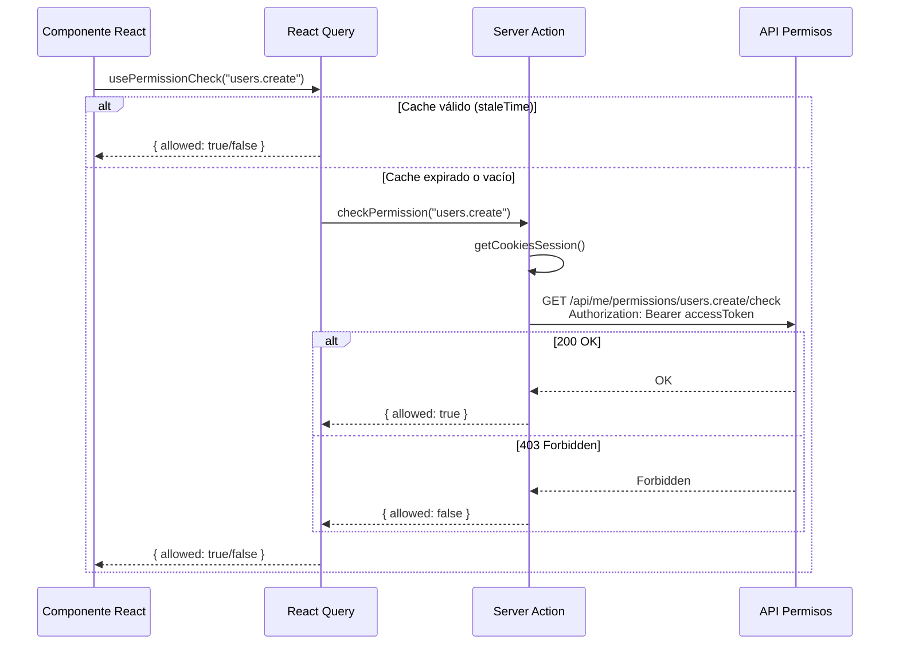
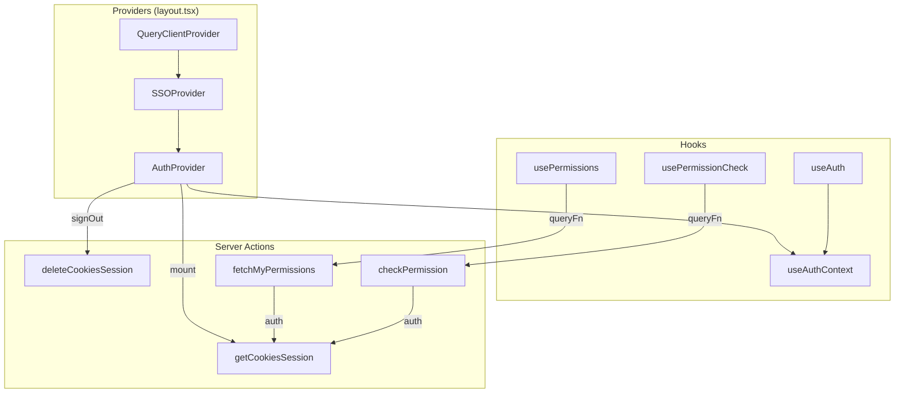
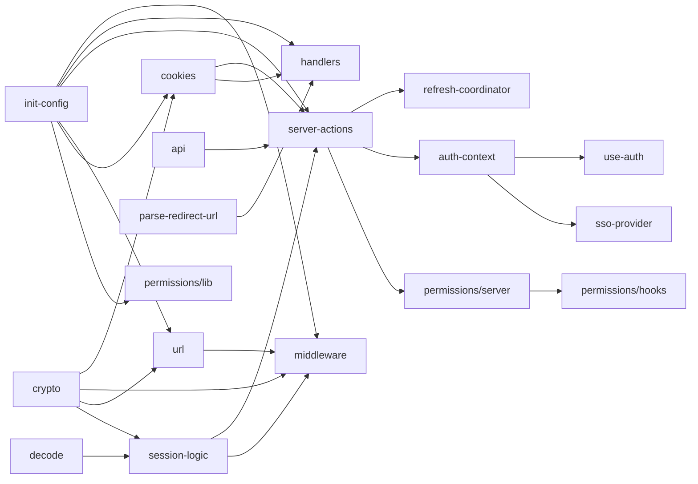

# 📦 zas-sso-client — Documentación Técnica

| Campo                   | Valor                                                                            |
| ----------------------- | -------------------------------------------------------------------------------- |
| **Proyecto**            | zas-sso-client                                                                   |
| **Versión**             | 1.2.50+999+9+                                                                    |
| **Licencia**            | MIT                                                                              |
| **Autor**               | AfroAg02                                                                         |
| **Repositorio**         | [github.com/AfroAg02/zas-sso-client](https://github.com/AfroAg02/zas-sso-client) |
| **Fecha de generación** | 29 de marzo de 2026                                                              |


---

## Tabla de Contenidos

- [1. Resumen Ejecutivo](#1-resumen-ejecutivo)
- [2. Requisitos y Dependencias](#2-requisitos-y-dependencias)
  - [2.1. Peer Dependencies (runtime)](#21-peer-dependencies-runtime)
  - [2.2. Dev Dependencies](#22-dev-dependencies)
- [3. Instalación y Configuración](#3-instalación-y-configuración)
  - [3.1. Instalación](#31-instalación)
  - [3.2. Variables de Entorno](#32-variables-de-entorno)
  - [3.3. Configuración Mínima](#33-configuración-mínima)
  - [3.4. initSSO() — Referencia Completa](#34-initsso--referencia-completa)
- [4. Arquitectura General](#4-arquitectura-general)
  - [4.1. Tres Capas](#41-tres-capas)
  - [4.2. Diagrama de Arquitectura](#42-diagrama-de-arquitectura)
  - [4.3. Justificación de Diseño](#43-justificación-de-diseño)
- [5. Estructura del Proyecto](#5-estructura-del-proyecto)
- [6. Puntos de Entrada (Exports)](#6-puntos-de-entrada-exports)
  - [6.1. Entry Point Principal — index.ts](#61-entry-point-principal--indexts)
  - [6.2. Entry Point Edge — edge.ts](#62-entry-point-edge--edgets)
  - [6.3. Configuración de Exports en package.json](#63-configuración-de-exports-en-packagejson)
- [7. Capa de Configuración](#7-capa-de-configuración)
  - [7.1. Configuración Interna (config)](#71-configuración-interna-config)
  - [7.2. Getters](#72-getters)
  - [7.3. SSOInitOptions](#73-ssoinitsOptions)
  - [7.4. Normalización de URLs](#74-normalización-de-urls)
- [8. Capa de Seguridad y Criptografía](#8-capa-de-seguridad-y-criptografía)
  - [8.1. crypto.ts — Cifrado y Descifrado](#81-cryptots--cifrado-y-descifrado)
  - [8.2. cookies.ts — Gestión de Cookies](#82-cookiests--gestión-de-cookies)
  - [8.3. decode.ts — Parsing de JWT](#83-decodets--parsing-de-jwt)
- [9. Capa HTTP y API](#9-capa-http-y-api)
  - [9.1. api.ts — Manejo de Errores y Respuestas](#91-apits--manejo-de-errores-y-respuestas)
  - [9.2. url.ts — Construcción de URLs](#92-urlts--construcción-de-urls)
  - [9.3. parse-redirect-url.ts — Validación de Redirects](#93-parse-redirect-urlts--validación-de-redirects)
- [10. Capa de Servicios](#10-capa-de-servicios)
  - [10.1. handlers.ts — Route Handlers SSO](#101-handlersts--route-handlers-sso)
  - [10.2. server-actions.ts — Server Actions](#102-server-actionsts--server-actions)
  - [10.3. refresh-coordinator.ts — Coordinador de Refresh](#103-refresh-coordinatorts--coordinador-de-refresh)
  - [10.4. session-logic.ts — Lógica de Sesión](#104-session-logicts--lógica-de-sesión)
- [11. Middleware (Protección de Rutas)](#11-middleware-protección-de-rutas)
  - [11.1. createSSOMiddleware()](#111-createssomiddleware)
  - [11.2. buildMiddlewareConfig()](#112-buildmiddlewareconfig)
  - [11.3. Funciones Internas](#113-funciones-internas)
- [12. Capa de Cliente React](#12-capa-de-cliente-react)
  - [12.1. AuthProvider y AuthContext](#121-authprovider-y-authcontext)
  - [12.2. useAuth()](#122-useauth)
  - [12.3. SSOProvider](#123-ssoprovider)
  - [12.4. Ejemplo de Integración](#124-ejemplo-de-integración)
- [13. Sistema de Permisos](#13-sistema-de-permisos)
  - [13.1. Configuración (lib.ts)](#131-configuración-libts)
  - [13.2. Server Actions (server.ts)](#132-server-actions-serverts)
  - [13.3. Hooks de Cliente (hooks.ts)](#133-hooks-de-cliente-hooksts)
- [14. Sistema de Tipos](#14-sistema-de-tipos)
  - [14.1. Tipos Core (types/index.ts)](#141-tipos-core-typesindexts)
  - [14.2. Tipos de API (types/fetch/api.ts)](#142-tipos-de-api-typesfetchapits)
  - [14.3. Module Augmentation](#143-module-augmentation)
- [15. Utilidades](#15-utilidades)
- [16. Flujos de Autenticación](#16-flujos-de-autenticación)
  - [16.1. Flujo de Login Completo](#161-flujo-de-login-completo)
  - [16.2. Flujo de Refresh de Tokens](#162-flujo-de-refresh-de-tokens)
  - [16.3. Flujo de Logout](#163-flujo-de-logout)
  - [16.4. Flujo de Protección de Rutas](#164-flujo-de-protección-de-rutas)
  - [16.5. Flujo de Verificación de Permisos](#165-flujo-de-verificación-de-permisos)
- [17. Diagramas](#17-diagramas)
- [18. Contratos de API / Endpoints](#18-contratos-de-api--endpoints)
  - [18.1. Endpoints Internos (Route Handlers)](#181-endpoints-internos-route-handlers)
  - [18.2. Endpoints Externos Consumidos](#182-endpoints-externos-consumidos)
- [19. Variables de Entorno](#19-variables-de-entorno)
- [20. Guía de Testing](#20-guía-de-testing)
- [21. Seguridad y Buenas Prácticas](#21-seguridad-y-buenas-prácticas)
- [22. Glosario](#22-glosario)
- [23. Changelog / Historial de Versiones](#23-changelog--historial-de-versiones)

---

## 1. Resumen Ejecutivo

**zas-sso-client** es un SDK de autenticación SSO (Single Sign-On) diseñado exclusivamente para aplicaciones **Next.js**. Proporciona un flujo completo de autenticación basado en tokens (JWT), manejo de sesiones cifradas en cookies, refresco automático de tokens y un sistema de control de permisos granular.

El proyecto resuelve la necesidad de integrar aplicaciones Next.js con el servidor de autenticación **ZAS Distributor**, abstrayendo toda la complejidad de:

- Cifrado/descifrado de sesiones en cookies (AES-GCM 256-bit con PBKDF2)
- Flujos de callback OAuth-like
- Protección de rutas via middleware
- Refresco concurrente de tokens (con deduplicación)
- Verificación de permisos tanto en cliente como en servidor
- Soporte para Edge Runtime (middleware de Next.js)

**Stack tecnológico**: Next.js (>=13 <17), React (>=18 <20), jose (cifrado JWE + PBKDF2), @tanstack/react-query (cache de permisos), TypeScript 5.9+.

---

## 2. Requisitos y Dependencias

### 2.1. Peer Dependencies (runtime)

El consumidor debe instalar estas dependencias en su proyecto:

| Dependencia             | Versión    | Propósito                                                         |
| ----------------------- | ---------- | ----------------------------------------------------------------- |
| `next`                  | `>=13 <17` | Framework de aplicación (middleware, server actions, cookies API) |
| `react`                 | `>=18 <20` | Renderizado de componentes, Context API, hooks                    |
| `react-dom`             | `>=18 <20` | Renderizado en DOM                                                |
| `jose`                  | `^6.1.3`   | Cifrado JWE (CompactEncrypt/compactDecrypt), base64url, PBKDF2    |
| `@tanstack/react-query` | `^5.90.12` | Cache y fetching de permisos en cliente                           |

### 2.2. Dev Dependencies

Usadas solo durante el desarrollo del SDK:

| Dependencia            | Versión   | Propósito                        |
| ---------------------- | --------- | -------------------------------- |
| `typescript`           | `^5.9.3`  | Compilador TypeScript            |
| `vitest`               | `^4.0.18` | Framework de testing             |
| `@vitejs/plugin-react` | `^5.1.3`  | Plugin de React para Vitest/Vite |
| `jsdom`                | `^28.0.0` | Emulación de DOM para tests      |
| `tsx`                  | `^4.21.0` | Ejecución directa de TypeScript  |
| `@types/node`          | `^25.0.0` | Tipos de Node.js                 |
| `@types/react`         | `^19.2.7` | Tipos de React                   |

---

## 3. Instalación y Configuración

### 3.1. Instalación

```bash
npm install zas-sso-client
```

Las peer dependencies deben estar presentes en el proyecto consumidor:

```bash
npm install next react react-dom jose @tanstack/react-query
```

### 3.2. Variables de Entorno

| Variable                              | Descripción                                                 | Requerida | Default                                             | Ejemplo                                     |
| ------------------------------------- | ----------------------------------------------------------- | --------- | --------------------------------------------------- | ------------------------------------------- |
| `NEXT_PUBLIC_APP_URL`                 | URL base de la aplicación                                   | **Sí**    | —                                                   | `https://miapp.com`                         |
| `NEXT_PUBLIC_SSO_URL`                 | URL de la página de login SSO                               | No        | `https://login.zasdistributor.com/login`            | `https://login.custom.com/login`            |
| `NEXT_PUBLIC_API_URL`                 | URL base de la API del backend                              | No        | `https://api.zasdistributor.com`                    | `https://api.custom.com`                    |
| `NEXT_PUBLIC_REFRESH_ENDPOINT`        | Endpoint alternativo para refresh de tokens                 | No        | `{API_URL}/auth/refresh`                            | `https://api.custom.com/auth/refresh`       |
| `NEXT_PUBLIC_REGISTER_CALLBACK_URL`   | Ruta de callback tras registro                              | No        | `/`                                                 | `/onboarding`                               |
| `NEXT_PUBLIC_SSO_ERROR_REDIRECT_PATH` | Ruta relativa para redirección en caso de error de callback | No        | —                                                   | `/auth/error`                               |
| `NEXT_PUBLIC_PERMISSIONS_ENDPOINT`    | URL base del endpoint de permisos                           | No        | `https://api.zasdistributor.com/api/me/permissions` | `https://api.custom.com/api/me/permissions` |
| `ENCRYPTION_SECRET`                   | Secreto para cifrado AES-GCM de cookies                     | **Sí**    | —                                                   | `mi-secreto-seguro-de-32-chars`             |
| `SSO_DEBUG`                           | Habilitar logs de depuración                                | No        | `false`                                             | `true`                                      |
| `NODE_ENV`                            | Entorno de ejecución (afecta flag `Secure` de cookies)      | —         | —                                                   | `production`                                |

### 3.3. Configuración Mínima

**1. Crear el archivo `middleware.ts` en la raíz del proyecto Next.js:**

```typescript
import { initSSO } from "zas-sso-client";

const { middleware, config } = initSSO({
  appUrl: process.env.NEXT_PUBLIC_APP_URL,
  protectedRoutes: ["/dashboard", "/settings"],
});

export default middleware;
export { config };
```

**2. Envolver la app con el Provider en `app/layout.tsx`:**

```typescript
import { SSOProvider } from "zas-sso-client";
import { QueryClient, QueryClientProvider } from "@tanstack/react-query";

export default function RootLayout({ children }) {
  return (
    <html>
      <body>
        <QueryClientProvider client={new QueryClient()}>
          <SSOProvider>
            {children}
          </SSOProvider>
        </QueryClientProvider>
      </body>
    </html>
  );
}
```

**3. Crear el route handler para el callback SSO en `app/api/sso/[...action]/route.ts`:**

```typescript
import { ssoHandlers } from "zas-sso-client";

export const { GET, POST, DELETE } = ssoHandlers;
```

### 3.4. initSSO() — Referencia Completa

```typescript
const { middleware, config, handlers } = initSSO({
  // URL base de la aplicación (requerido para construir redirects)
  appUrl: "https://miapp.com",

  // URL de la página de login del SSO
  ssoUrl: "https://login.zasdistributor.com/login",

  // Ruta de redirección tras login exitoso
  redirectUri: "/",

  // Ruta de callback tras registro
  registerCallbackUri: "/onboarding",

  // Nombre de la cookie de sesión
  cookieName: "session",

  // Tiempo máximo de vida de la cookie (en segundos, default: 7 días)
  cookieMaxAgeSeconds: 60 * 60 * 24 * 7,

  // Rutas que requieren autenticación
  protectedRoutes: ["/dashboard", "/settings"],

  // Redirección automática cuando se refresca un token
  automaticRedirectOnRefresh: true,

  // Habilitar logs de depuración
  debug: false,

  // Override de endpoints de la API
  endpoints: {
    login: "https://api.custom.com/auth/login",
    refresh: "https://api.custom.com/auth/refresh",
    me: "https://api.custom.com/users/me",
  },
});
```

**Retorna:**

| Propiedad    | Tipo                                          | Descripción                                          |
| ------------ | --------------------------------------------- | ---------------------------------------------------- |
| `middleware` | `(req: NextRequest) => Promise<NextResponse>` | Función de middleware para Next.js                   |
| `config`     | `{ matcher: string[] }`                       | Configuración de matchers para `export const config` |
| `handlers`   | `{ GET, POST, DELETE }`                       | Route handlers para el callback SSO                  |

---

## 4. Arquitectura General

### 4.1. Tres Capas

El SDK se organiza en tres capas bien definidas, cada una con restricciones de runtime específicas:

| Capa          | Runtime                   | Archivos                                                                                       | Responsabilidad                                                                         |
| ------------- | ------------------------- | ---------------------------------------------------------------------------------------------- | --------------------------------------------------------------------------------------- |
| **Edge**      | Edge Runtime (middleware) | `crypto.ts`, `decode.ts`, `url.ts`, `middleware.ts`, `parse-redirect-url.ts`                   | Validación de sesión, redirección, operaciones criptográficas. Sin React.               |
| **Servicios** | Node.js (Server)          | `server-actions.ts`, `handlers.ts`, `refresh-coordinator.ts`, `session-logic.ts`, `cookies.ts` | Operaciones de autenticación, persistencia en cookies, refresh de tokens. "use server". |
| **Cliente**   | Browser                   | `auth-context.tsx`, `sso-provider.tsx`, `use-auth.ts`, `hooks.ts` (permisos)                   | Estado de autenticación en React, hooks, React Query. "use client".                     |

### 4.2. Diagrama de Arquitectura



### 4.3. Justificación de Diseño

1. **Separación Edge-safe**: El Edge Runtime de Next.js no soporta todas las APIs de Node.js. El entry point `edge.ts` exporta solo funciones compatibles (sin React, sin APIs de Node exclusivas como `Buffer` en ciertos contextos).

2. **"use server" para mutaciones**: Todas las operaciones que modifican cookies usan Server Actions de Next.js, lo que garantiza que el cifrado y la manipulación de cookies solo ocurren en el servidor.

3. **"use client" para estado**: El estado de autenticación vive en React Context, permitiendo reactividad inmediata en componentes sin prop-drilling.

4. **Coordinador de refresh**: Un `Map` de promesas activas y un `Set` de tokens fallidos previenen condiciones de carrera y reintentos infinitos cuando múltiples componentes necesitan un token fresco simultáneamente.

---

## 5. Estructura del Proyecto

```
zas-sso-client/
├── src/
│   ├── index.ts                    # Barrel de exports — API pública principal
│   ├── edge.ts                     # Barrel de exports — API segura para Edge Runtime
│   ├── init-config.ts              # Configuración global e inicialización (initSSO)
│   ├── __tests__/
│   │   └── init.test.ts            # Tests unitarios de configuración
│   ├── client/                     # 🔲 Reservado para uso futuro
│   ├── context/
│   │   └── auth-context.tsx        # AuthProvider + useAuthContext (React Context)
│   ├── entries/                    # 🔲 Reservado para uso futuro
│   ├── hooks/
│   │   └── use-auth.ts             # Hook useAuth() — wrapper de useAuthContext
│   ├── lib/
│   │   ├── api.ts                  # ApiError, ApiResponse, manejo de errores HTTP
│   │   ├── cookies.ts              # CRUD de cookies cifradas (server-only)
│   │   ├── crypto.ts               # Cifrado AES-GCM + PBKDF2, generación de state
│   │   ├── decode.ts               # Parsing de claims JWT (sin verificación)
│   │   ├── middleware.ts           # createSSOMiddleware, buildMiddlewareConfig
│   │   ├── parse-redirect-url.ts   # Validación de redirects same-origin
│   │   └── url.ts                  # getLoginUrl, redirectToLogin
│   ├── permissions-control/
│   │   ├── hooks.ts                # usePermissions, usePermissionCheck (React Query)
│   │   ├── lib.ts                  # Configuración de endpoints de permisos
│   │   └── server.ts              # fetchMyPermissions, checkPermission (server actions)
│   ├── providers/
│   │   └── sso-provider.tsx        # SSOProvider — wrapper simplificado de AuthProvider
│   ├── server/                     # 🔲 Reservado para uso futuro
│   ├── services/
│   │   ├── handlers.ts             # Route handlers (GET/POST/DELETE) para callback SSO
│   │   ├── refresh-coordinator.ts  # Orquestador de refresh concurrente (Map + Set)
│   │   ├── server-actions.ts       # Server Actions: autenticación, sesión, refresh
│   │   └── session-logic.ts        # Descifrado y validación de sesión
│   ├── shared/                     # 🔲 Reservado para uso futuro
│   ├── types/
│   │   ├── index.ts                # Tipos principales (User, Session, Tokens, etc.)
│   │   └── fetch/
│   │       └── api.ts              # Tipo ApiResponse<T>
│   └── utils/
│       └── html-page-error.ts      # Generador de páginas HTML de error
├── playground/
│   └── test-dist.js                # Script de prueba del build
├── dist/                           # Output compilado (ESM + declaraciones)
├── package.json
├── tsconfig.json
├── tsup.config.ts
├── README.md
├── TESTING_LOCALLY.md
└── LICENSE
```

> **Nota**: Las carpetas `client/`, `server/`, `shared/` y `entries/` están vacías y reservadas para futuras expansiones del SDK.

---

## 6. Puntos de Entrada (Exports)

### 6.1. Entry Point Principal — `index.ts`

Este es el entry point completo. Incluye todo lo necesario para integrar el SDK en una aplicación Next.js.

| Export                   | Origen                            | Tipo          | Descripción                                               |
| ------------------------ | --------------------------------- | ------------- | --------------------------------------------------------- |
| `initSSO`                | `init-config.ts`                  | Función       | Inicializa la configuración global                        |
| `SSO`                    | `init-config.ts`                  | Objeto        | `{ init: initSSO }`                                       |
| `getConfig`              | `init-config.ts`                  | Función       | Retorna la configuración actual                           |
| `getRedirectUri`         | `init-config.ts`                  | Función       | Retorna la URI de redirección configurada                 |
| `getregisterCallbackUri` | `init-config.ts`                  | Función       | Retorna la URI de callback de registro                    |
| `AuthProvider`           | `context/auth-context.tsx`        | Componente    | Provider de autenticación React                           |
| `useAuthContext`         | `context/auth-context.tsx`        | Hook          | Acceso directo al contexto de auth                        |
| `AuthContextState`       | `context/auth-context.tsx`        | Tipo          | Interfaz del estado de autenticación                      |
| `SSOProvider`            | `providers/sso-provider.tsx`      | Componente    | Wrapper simplificado de AuthProvider                      |
| `useAuth`                | `hooks/use-auth.ts`               | Hook          | Hook principal de autenticación                           |
| `usePermissions`         | `permissions-control/hooks.ts`    | Hook          | Obtiene todos los permisos del usuario                    |
| `usePermissionCheck`     | `permissions-control/hooks.ts`    | Hook          | Verifica un permiso específico                            |
| `serverSignOut`          | `services/server-actions.ts`      | Server Action | Elimina la sesión del servidor                            |
| `getServerSession`       | `services/server-actions.ts`      | Server Action | Obtiene la sesión desde cookies (con cache)               |
| `getServerValidToken`    | `services/refresh-coordinator.ts` | Función       | Obtiene un access token válido (refresca si es necesario) |
| `checkPermission`        | `permissions-control/server.ts`   | Server Action | Verifica un permiso en el servidor                        |
| `fetchMyPermissions`     | `permissions-control/server.ts`   | Server Action | Obtiene todos los permisos del usuario                    |
| `getJWTClaims`           | `lib/decode.ts`                   | Función       | Parsea claims de un JWT                                   |
| `getLoginUrl`            | `lib/url.ts`                      | Función       | Construye la URL de login SSO                             |
| `redirectToLogin`        | `lib/url.ts`                      | Función       | Redirige al login (server o client)                       |
| `ssoHandlers`            | `services/handlers.ts`            | Objeto        | `{ GET, POST, DELETE }` route handlers                    |
| `createSSOMiddleware`    | `lib/middleware.ts`               | Función       | Crea el middleware de protección                          |
| `buildMiddlewareConfig`  | `lib/middleware.ts`               | Función       | Genera la configuración de matchers                       |
| `* from types`           | `types/index.ts`                  | Tipos         | Todos los tipos exportados                                |

### 6.2. Entry Point Edge — `edge.ts`

Subconjunto seguro para Edge Runtime. **No incluye React ni dependencias de browser.**

| Export                   | Origen                          | Descripción                 |
| ------------------------ | ------------------------------- | --------------------------- |
| `initSSO`                | `init-config.ts`                | Inicialización              |
| `SSO`                    | `init-config.ts`                | Objeto con `init`           |
| `getRedirectUri`         | `init-config.ts`                | URI de redirección          |
| `getregisterCallbackUri` | `init-config.ts`                | URI de callback de registro |
| `getLoginUrl`            | `lib/url.ts`                    | URL de login SSO            |
| `redirectToLogin`        | `lib/url.ts`                    | Redirección a login         |
| `getJWTClaims`           | `lib/decode.ts`                 | Parsing de JWT claims       |
| `checkPermission`        | `permissions-control/server.ts` | Verificación de permiso     |
| `fetchMyPermissions`     | `permissions-control/server.ts` | Lista de permisos           |
| `getCookiesSession`      | `services/server-actions.ts`    | Lectura de sesión           |
| `serverSignOut`          | `services/server-actions.ts`    | Limpieza de sesión          |

### 6.3. Configuración de Exports en package.json

```json
{
  "exports": {
    ".": {
      "types": "./dist/index.d.ts",
      "import": "./dist/index.js"
    },
    "./edge": {
      "types": "./dist/edge.d.ts",
      "import": "./dist/edge.js"
    },
    "./README.md": "./README.md",
    "./package.json": "./package.json"
  }
}
```

- **`"type": "module"`**: El paquete usa ESM nativamente.
- **`sideEffects: false`**: Permite tree-shaking agresivo.
- El build con `tsup` genera formatos ESM y CJS, con declaraciones TypeScript y source maps.

---

## 7. Capa de Configuración

**Archivo**: `src/init-config.ts`

### 7.1. Configuración Interna (config)

El módulo mantiene un objeto `config` mutable a nivel de módulo que se inicializa con valores por defecto y variables de entorno:

```typescript
const config = {
  NEXT_PUBLIC_APP_URL: normalizeUrl(process.env.NEXT_PUBLIC_APP_URL),
  NEXT_PUBLIC_SSO_URL: normalizeUrl(
    process.env.NEXT_PUBLIC_SSO_URL ?? "https://login.zasdistributor.com/login",
  ),
  REDIRECT_URI: "/",
  REGISTER_REDIRECT_URI: normalizeUrl(
    process.env.NEXT_PUBLIC_REGISTER_CALLBACK_URL ?? "/",
  ),
  ERROR_REDIRECT_PATH: process.env.NEXT_PUBLIC_SSO_ERROR_REDIRECT_PATH?.trim(),
  MAX_COOKIES_AGE: 60 * 60 * 24 * 7, // 7 días
  COOKIE_SESSION_NAME: "session",
  ENDPOINTS: {
    login: `${apiBase}/auth/login`,
    refresh: refreshEndpointEnv || `${apiBase}/auth/refresh`,
    me: `${apiBase}/users/me`,
  },
  AUTOMATIC_REDIRECT_ON_REFRESH: true,
  DEBUG: parseBooleanEnv(process.env.SSO_DEBUG),
};
```

### 7.2. Getters

| Función                    | Retorno                  | Descripción                          |
| -------------------------- | ------------------------ | ------------------------------------ |
| `getConfig()`              | `typeof config`          | Objeto completo de configuración     |
| `getAppUrl()`              | `string \| undefined`    | URL base de la aplicación            |
| `getSsoUrl()`              | `string \| undefined`    | URL del login SSO                    |
| `getRedirectUri()`         | `string`                 | URI de redirección post-login        |
| `getregisterCallbackUri()` | `string`                 | URI de callback post-registro        |
| `getErrorRedirectUrl()`    | `string \| undefined`    | URL completa de redirección de error |
| `getEndpoints()`           | `{ login, refresh, me }` | Endpoints de la API                  |
| `getDebug()`               | `boolean`                | Estado del modo debug                |

### 7.3. SSOInitOptions

```typescript
interface SSOInitOptions {
  protectedRoutes?: string[]; // Rutas que requieren autenticación
  cookieName?: string; // Nombre de la cookie (default: "session")
  appUrl?: string; // URL base de la app
  ssoUrl?: string; // URL de login SSO
  redirectUri?: string; // URI post-login (default: "/")
  registerCallbackUri?: string; // URI post-registro
  cookieMaxAgeSeconds?: number; // TTL de cookie en segundos (default: 604800)
  automaticRedirectOnRefresh?: boolean; // Redirigir al refrescar token
  debug?: boolean; // Habilitar logs
  endpoints?: Partial<{
    login: string; // Endpoint de login
    refresh: string; // Endpoint de refresh
    me: string; // Endpoint de perfil
  }>;
}
```

### 7.4. Normalización de URLs

La función `normalizeUrl()` elimina slashes finales para evitar dobles slashes al concatenar rutas:

```typescript
function normalizeUrl(url?: string) {
  if (!url) return url;
  if (url === "/") return "/";
  return url.replace(/\/+$/, "");
}
```

La función `parseBooleanEnv()` interpreta valores de entorno como booleanos, manejando comillas y formas comunes (`true`, `1`, `yes`, `on`):

```typescript
function parseBooleanEnv(val?: string): boolean {
  if (!val) return false;
  const clean = val.trim().replace(/^['"]|['"]$/g, "");
  return /^(true|1|yes|on)$/i.test(clean);
}
```

---

## 8. Capa de Seguridad y Criptografía

### 8.1. crypto.ts — Cifrado y Descifrado

**Archivo**: `src/lib/crypto.ts`

Este módulo implementa cifrado simétrico de sesiones usando **JWE (JSON Web Encryption)** a través de la librería `jose`.

#### Algoritmos

| Parámetro           | Valor               | Descripción                                |
| ------------------- | ------------------- | ------------------------------------------ |
| Cifrado             | `A256GCM`           | AES-GCM con clave de 256 bits              |
| Algoritmo de clave  | `dir`               | Clave simétrica directa (sin key wrapping) |
| Derivación de clave | PBKDF2              | SHA-256, 100,000 iteraciones               |
| Salt                | 16 bytes aleatorios | Generado con `crypto.getRandomValues()`    |

#### Formato de Salida

El texto cifrado tiene el formato:

```
{saltHex}:{JWE Compact Serialization}
```

Ejemplo:

```
a1b2c3d4e5f6a7b8c9d0e1f2a3b4c5d6:eyJhbGciOiJkaXIiLCJlbmMiOiJBMjU2R0NNIn0..IV.ciphertext.tag
```

- **saltHex**: 32 caracteres hexadecimales (16 bytes)
- **JWE**: 5 partes separadas por `.` (header, encrypted_key vacío para `dir`, IV, ciphertext, tag)

#### Funciones Exportadas

**`encrypt(text: string): Promise<string>`**

1. Genera un salt aleatorio de 16 bytes
2. Deriva una clave de 256 bits usando PBKDF2 (SHA-256, 100k iteraciones) con `ENCRYPTION_SECRET`
3. Cifra el texto usando `CompactEncrypt` de jose con AES-GCM
4. Retorna `saltHex:JWE`

**`decrypt(encryptedText: string): Promise<string>`**

1. Separa el salt del JWE
2. Detecta si es formato nuevo (`saltHex:JWE`) o legacy (`salt:iv:tag:cipher`)
3. Valida que el JWE tenga exactamente 4 puntos (5 segmentos)
4. Deriva la clave con el mismo salt y secreto
5. Descifra con `compactDecrypt` de jose
6. Fallback a `legacyDecrypt()` para formato antiguo (que lanza error: ya no soportado)

**`generateStateBase64Url(bytes = 16): string`**

Genera un string aleatorio codificado en base64url, usado como parámetro `state` para protección CSRF en el flujo de login.

#### Seguridad del Secreto

El secreto se lee de `process.env.ENCRYPTION_SECRET`. Si no existe, se lanza un error inmediato. La clave nunca se deriva una sola vez — se regenera en cada operación de cifrado/descifrado con un salt único.

### 8.2. cookies.ts — Gestión de Cookies

**Archivo**: `src/lib/cookies.ts` — Marcado con `"use server"`

| Función                   | Firma                                  | Descripción                                                                        |
| ------------------------- | -------------------------------------- | ---------------------------------------------------------------------------------- |
| `setSessionCookies`       | `(data: SessionData) => Promise<void>` | Cifra `data` como JSON, lo almacena en cookie. También setea cookie `updatedDate`. |
| `readCookies`             | `() => Promise<string \| undefined>`   | Lee el valor crudo (cifrado) de la cookie de sesión                                |
| `clearSessionCookies`     | `() => Promise<void>`                  | Elimina la cookie de sesión                                                        |
| `getSessionCookieOptions` | `() => Promise<CookieOptions>`         | Retorna las opciones de la cookie                                                  |

#### Opciones de Cookie

```typescript
{
  name: config.COOKIE_SESSION_NAME,  // default: "session"
  maxAge: config.MAX_COOKIES_AGE,    // default: 604800 (7 días)
  httpOnly: true,                    // No accesible desde JavaScript
  secure: process.env.NODE_ENV === "production",  // Solo HTTPS en producción
  sameSite: "lax",                   // Protección CSRF parcial
  path: "/",                         // Disponible en toda la app
}
```

### 8.3. decode.ts — Parsing de JWT

**Archivo**: `src/lib/decode.ts`

**`getJWTClaims(jwtToken: string): JWTClaims | null`**

Decodifica el payload de un JWT **sin verificar la firma**. Esto es un trade-off intencional:

- **Ventaja**: No requiere acceso a la clave pública o secreto del emisor del JWT.
- **Riesgo**: El contenido del payload podría estar manipulado. La verificación de autenticidad depende del servidor SSO durante el flujo de autenticación.

**Retorna:**

```typescript
{
  iat: number; // Timestamp UNIX de emisión
  exp: number; // Timestamp UNIX de expiración
  issuedAt: Date; // Date de emisión
  expiresAt: Date; // Date de expiración
}
```

---

## 9. Capa HTTP y API

### 9.1. api.ts — Manejo de Errores y Respuestas

**Archivo**: `src/lib/api.ts`

#### Clase `ApiError`

```typescript
class ApiError extends Error {
  title: string;
  status: number;
  detail: string;

  constructor(error: CustomApiError & object);
  toString(): string; // "title - status - detail"
}
```

#### Tipo `ApiResponse<T>`

```typescript
type ApiResponse<T> = {
  data?: T;
  error: boolean;
  status: number;
  message?: string;
} & CustomApiError;
```

#### Funciones

| Función                    | Firma                                             | Descripción                                                                                    |
| -------------------------- | ------------------------------------------------- | ---------------------------------------------------------------------------------------------- |
| `isApiError`               | `(error: unknown) => error is ApiError`           | Type guard para ApiError                                                                       |
| `handleApiServerError<T>`  | `(response: Response) => Promise<ApiResponse<T>>` | Parsea respuesta de error HTTP. Maneja JSON y texto plano. Retorna 401 con mensaje localizado. |
| `buildApiResponseAsync<T>` | `(response: Response) => Promise<ApiResponse<T>>` | Parsea respuesta exitosa. Maneja 204 (no content).                                             |
| `getErrorMessage`          | `(error: unknown) => string`                      | Extrae mensaje de error de cualquier formato (string, Error, ApiError, array).                 |

### 9.2. url.ts — Construcción de URLs

**Archivo**: `src/lib/url.ts`

**`getLoginUrl(): string`**

Construye la URL completa de login SSO:

1. Genera un `state` aleatorio (CSRF protection) con `generateStateBase64Url()`
2. Crea un `URL` a partir de la `ssoUrl` configurada
3. Añade `state` como query parameter
4. Añade `redirect_uri` apuntando a `{appUrl}/api/sso/callback`
5. Si hay `registerCallbackUri` configurado (distinto de `/`), añade `register_callback_uri`
6. Retorna la URL como string

**Ejemplo de URL generada:**

```
https://login.zasdistributor.com/login?state=qVt2o9bq3f0Lk1v0iUF7NQ&redirect_uri=https://miapp.com/api/sso/callback&register_callback_uri=https://miapp.com/onboarding
```

**`redirectToLogin(opts?: RedirectToLoginOptions): void`**

| Opción          | Tipo      | Default  | Descripción                                          |
| --------------- | --------- | -------- | ---------------------------------------------------- |
| `preservePath`  | `boolean` | `false`  | Guarda la ruta actual como parámetro `from`          |
| `replace`       | `boolean` | `false`  | Usa `window.location.replace()` en vez de `assign()` |
| `fromParamName` | `string`  | `"from"` | Nombre del parámetro de query para la ruta actual    |

- **Server**: Llama a `nextRedirect(loginUrl)` (lanza excepción controlada)
- **Client**: Llama a `window.location.assign(loginUrl)` o `replace(loginUrl)`

### 9.3. parse-redirect-url.ts — Validación de Redirects

**Archivo**: `src/lib/parse-redirect-url.ts`

**`parseRedirectUrl(redirectTo: string, baseOrigin: string): string`**

Valida que un URL de redirección sea seguro (same-origin):

1. Si `redirectTo` es una URL absoluta (`https://...`), verifica que el origin coincida con `baseOrigin`. Si no coincide, retorna `baseOrigin + "/"`.
2. Si es una ruta relativa, la resuelve contra `baseOrigin`.
3. En caso de cualquier error de parsing, retorna `baseOrigin + "/"`.

**Protección**: Previene ataques de **open redirect** al asegurar que solo se acepten URLs del mismo origin.

---

## 10. Capa de Servicios

### 10.1. handlers.ts — Route Handlers SSO

**Archivo**: `src/services/handlers.ts`

Exporta `handlers = { GET, POST, DELETE }` para usar como route handlers de Next.js en la ruta `/api/sso/[...action]` o similar.

#### `GET(request: Request): Promise<Response>`

**Propósito**: Callback del flujo de login SSO. El servidor SSO redirige aquí con los tokens.

**Flujo paso a paso:**

1. Extrae `accessToken` y `refreshToken` de los query parameters
2. Si falta alguno, retorna error (redirect a error URL o página HTML de error)
3. Llama a `authenticateWithTokens({ accessToken, refreshToken })`
4. Si la autenticación falla, retorna error con el status correspondiente
5. Construye la URL de redirección usando `getRedirectUri()` + `parseRedirectUrl()`
6. **Sanitiza la URL**: elimina `accessToken`, `refreshToken` y `state` de los query params
7. Retorna `NextResponse.redirect()` con status 302

**Manejo de errores**: Si `NEXT_PUBLIC_SSO_ERROR_REDIRECT_PATH` está configurado, redirige a esa ruta con parámetros `error` y `status`. Si no, retorna una página HTML de error estilizada vía `htmlError()`.

#### `POST(request: Request): Promise<Response>`

**Propósito**: Endpoint alternativo para establecer sesión programáticamente.

1. Parsea el body como `SessionData`
2. Llama a `setSessionCookies(data)`
3. Retorna `{ ok: true }` o error 500

#### `DELETE(request: Request): Promise<Response>`

**Propósito**: Endpoint para limpiar la sesión.

1. Llama a `clearSessionCookies()`
2. Retorna `{ ok: true }` o error 500

#### Función auxiliar — `getTokenRemainingSeconds(token: string): number | null`

Calcula los segundos restantes hasta la expiración de un JWT. Parsea el payload base64 del token para extraer el claim `exp`.

### 10.2. server-actions.ts — Server Actions

**Archivo**: `src/services/server-actions.ts` — Marcado con `"use server"`

#### `authenticateWithTokens(credentials: Tokens, callbacks?): Promise<ApiResponse<User | null>>`

**Flujo:**

1. Llama a `fetchUser(credentials.accessToken)` para obtener datos del usuario
2. Si no hay datos, retorna el error
3. Llama a `persistUserSessionInCookies()` con el usuario y tokens
4. Retorna `{ data: User, status: 200, error: false }`

#### `persistUserSessionInCookies(session: SessionData, callbacks?): Promise<void>`

**Flujo:**

1. Construye un `SessionData` limpio:
   - Filtra emails y phones solo activos (`.filter(e => e.active)`)
   - Incluye solo campos necesarios (reduce tamaño de cookie)
2. Llama a `setSessionCookies(sessionData)` que cifra y persiste

#### `deleteCookiesSession(callbacks?): Promise<void>`

Llama a `clearSessionCookies()`. Ejecuta callback de éxito/error.

#### `getCookiesSession(): Promise<SessionData>` (envuelto en `React.cache`)

**Flujo:**

1. Lee la cookie cifrada con `readCookies()`
2. Llama a `processSession()` para descifrar
3. Calcula `tokenExpiry` con tiempos restantes de ambos tokens
4. Log colorido en consola: `[getCookiesSession] accessTokenExpiresIn=Xs refreshTokenExpiresIn=Ys`
5. Retorna `SessionData` con `tokenExpiry` adjunto

**Importante**: Envuelto en `React.cache()` — se deduplica por request en React Server Components.

#### `fetchUser(accessToken: string): Promise<ApiResponse<User>>`

```
GET {endpoints.me}
Authorization: Bearer {accessToken}
```

#### `refreshSession(refreshToken: string, options?): Promise<ApiResponse<User | null>>`

**Flujo:**

1. Hace `POST` al endpoint de refresh con `{ refreshToken }`
2. Si la respuesta no es OK, logea el error y retorna error
3. Si es OK, parsea la respuesta como `Tokens`
4. Llama a `authenticateWithTokens(tokens)` para obtener usuario y persistir

### 10.3. refresh-coordinator.ts — Coordinador de Refresh

**Archivo**: `src/services/refresh-coordinator.ts`

Este módulo resuelve el problema de **múltiples componentes o requests intentando refrescar el mismo token simultáneamente**.

#### Estructuras de Estado

```typescript
// Promesas activas: un refresh por token
const activeRefreshes = new Map<string, Promise<string | null>>();

// Tokens que ya fallaron: blacklist temporal en memoria
const failedTokens = new Set<string>();
```

#### `getValidToken(currentRefreshToken: string | undefined): Promise<string | null>`

**Flujo paso a paso:**

1. **Sin token**: Retorna `null`
2. **Token en blacklist** (`failedTokens`): Retorna `null` sin intentar refresh
3. **Refresh ya en progreso** (`activeRefreshes.has(token)`): Retorna la misma promesa existente (deduplicación)
4. **Crear nuevo refresh**:
   a. Registra la promesa en `activeRefreshes`
   b. Llama a `refreshSession(currentRefreshToken)`
   c. Si hay error:
   - Status 400-499: Añade a `failedTokens` (no reintentar)
   - Retorna `null`
     d. Si éxito:
   - Lee nueva sesión con `getCookiesSession()`
   - Remueve de `failedTokens` (por si estaba)
   - Retorna el nuevo `accessToken`
     e. **Finally**: Siempre remueve de `activeRefreshes`

**Logging**: Extensivo, con colores ANSI (verde para éxito, rojo para error). Incluye payloads JWT mascarados para debugging.

### 10.4. session-logic.ts — Lógica de Sesión

**Archivo**: `src/services/session-logic.ts`

**`processSession(encryptedSession: string | undefined): Promise<{ session: SessionData, refreshed: boolean, error?: any }>`**

**Flujo:**

1. Si no hay sesión cifrada → retorna sesión vacía
2. Descifra con `decrypt(encryptedSession)`
3. Parsea el JSON
4. Si no hay `accessToken` → retorna sesión vacía con `shouldClear: true`
5. Retorna la sesión descifrada con `refreshed: false`

**Importante**: Esta función **nunca refresca tokens**. Solo descifra y valida. El refresh se hace explícitamente vía `refresh-coordinator.ts`.

---

## 11. Middleware (Protección de Rutas)

**Archivo**: `src/lib/middleware.ts`

### 11.1. createSSOMiddleware()

```typescript
function createSSOMiddleware(
  options?: SSOInitOptions,
): (req: NextRequest) => Promise<NextResponse>;
```

**Flujo de decisión:**

1. Extrae `pathname` de la request
2. Verifica si la ruta está protegida con `isProtected(pathname, protectedRoutes)`
3. **Si NO está protegida** → `NextResponse.next()` (dejar pasar)
4. **Si está protegida**:
   a. Lee la cookie de sesión
   b. Llama a `processSession(encryptedCookie)` para descifrar
   c. Si no hay `accessToken` válido → redirige a `getLoginUrl()` con `callbackUrl`
   d. Si hay sesión válida → `NextResponse.next()`
   e. Si la sesión fue refrescada (actualmente siempre `false`) → reescribe la cookie

### 11.2. buildMiddlewareConfig()

```typescript
function buildMiddlewareConfig(protectedRoutes?: string[]): {
  matcher: readonly string[];
};
```

- **Sin rutas**: Protege todo excepto `_next/` y `static/`
  ```typescript
  {
    matcher: ["/((?!_next/|static/).*)"];
  }
  ```
- **Con rutas**: Genera matchers por ruta
  ```typescript
  // protectedRoutes: ["/dashboard", "/settings"]
  {
    matcher: ["/dashboard/:path*", "/settings/:path*"];
  }
  ```

### 11.3. Funciones Internas

**`isProtected(pathname: string, protectedRoutes: string[] | null): boolean`**

Lógica de decisión:

1. Si el pathname contiene `"dashboard"` → **siempre protegido** (heurística hardcodeada)
2. Si no hay rutas definidas → usa `["/dashboard"]` como default
3. Si la ruta es `/` → protege todo
4. Verifica coincidencia exacta o por prefijo (`pathname.startsWith(prefix + "/")`)

**`isStaticAsset(pathname: string): boolean`**

Retorna `true` para rutas que empiezan con `/_next/` o `/static/`.

---

## 12. Capa de Cliente React

### 12.1. AuthProvider y AuthContext

**Archivo**: `src/context/auth-context.tsx` — Marcado con `"use client"`

#### Interfaz `AuthContextState`

```typescript
interface AuthContextState extends SessionData {
  isLoading: boolean;
  error: string | null;
  status: "loading" | "authenticated" | "unauthenticated";
  setSession: (session: SessionData) => void;
  signOut: (callbacks?) => Promise<void> | void;
  reloadSession: () => Promise<void>;
}
```

#### Máquina de Estados



#### Comportamiento del AuthProvider

1. **Montaje**: Ejecuta `reloadSession()` automáticamente en `useEffect`
2. **`reloadSession()`**:
   - Llama a `getCookiesSession()` (server action)
   - Si `session.shouldClear` → llama a `serverCleanSession()`
   - Si hay tokens → actualiza estado
   - Si no → limpia estado y setea error
3. **`signOut(callbacks?)`**:
   - Llama a `serverCleanSession()` (elimina cookies)
   - Limpia el estado local (user, tokens)
   - Ejecuta callbacks opcionales
4. **`setSession(session)`**: Actualiza user y tokens directamente

### 12.2. useAuth()

**Archivo**: `src/hooks/use-auth.ts` — Marcado con `"use client"`

```typescript
export const useAuth = () => {
  return useAuthContext();
};
```

Wrapper simple de `useAuthContext()`. Retorna toda la interfaz `AuthContextState`.

**Uso:**

```typescript
const { user, status, signOut, reloadSession } = useAuth();

if (status === "loading") return <Spinner />;
if (status === "unauthenticated") return <LoginButton />;
return <p>Hola, {user?.name}</p>;
```

### 12.3. SSOProvider

**Archivo**: `src/providers/sso-provider.tsx` — Marcado con `"use client"`

```typescript
export default function SSOProvider({ children }: { children: React.ReactNode }) {
  return <AuthProvider>{children}</AuthProvider>;
}
```

Wrapper simplificado. Existe para ofrecer una API más limpia al consumidor (`<SSOProvider>` vs `<AuthProvider>`).

### 12.4. Ejemplo de Integración

```typescript
// app/layout.tsx
import { SSOProvider } from "zas-sso-client";

export default function RootLayout({ children }) {
  return (
    <html><body>
      <SSOProvider>{children}</SSOProvider>
    </body></html>
  );
}

// app/dashboard/page.tsx
"use client";
import { useAuth, redirectToLogin } from "zas-sso-client";

export default function Dashboard() {
  const { user, status, signOut } = useAuth();

  if (status === "loading") return <p>Cargando...</p>;
  if (status === "unauthenticated") {
    redirectToLogin({ preservePath: true });
    return null;
  }

  return (
    <div>
      <h1>Bienvenido, {user?.name}</h1>
      
      <p>Email: {user?.emails[0]?.address}</p>
      <button onClick={() => signOut({ onSuccess: () => window.location.href = "/" })}>
        Cerrar sesión
      </button>
    </div>
  );
}
```

---

## 13. Sistema de Permisos

### 13.1. Configuración (lib.ts)

**Archivo**: `src/permissions-control/lib.ts`

```typescript
const permissionsBase =
  process.env.NEXT_PUBLIC_PERMISSIONS_ENDPOINT ||
  "https://api.zasdistributor.com/api/me/permissions";

export const ENDPOINTS = {
  permissions: permissionsBase, // GET - lista paginada
  check: (code: string) =>
    `${permissionsBase}/${encodeURIComponent(code)}/check`, // GET - verificación individual
};
```

### 13.2. Server Actions (server.ts)

**Archivo**: `src/permissions-control/server.ts` — Marcado con `"use server"`

#### Interfaz `Permission`

```typescript
interface Permission {
  id: number;
  name: string;
  code: string;
  description: string;
  entity: string;
  type: number;
  roleId: number;
  roleName: string;
  roleCode: string;
}
```

#### Interfaz `PaginatedPermissions`

```typescript
interface PaginatedPermissions {
  data: Permission[];
  totalCount: number;
  page: number;
  pageSize: number;
  hasNext: boolean;
  hasPrevious: boolean;
}
```

#### `fetchMyPermissions(): Promise<ApiResult<Permission[]>>`

**Flujo:**

1. Obtiene sesión con `getCookiesSession()`
2. Si no hay token → retorna `{ status: 401, error: "No session" }`
3. Itera páginas con `pageSize=10000` hasta `hasNext === false`
4. Concatena todos los `Permission[]` de cada página
5. Retorna `{ status: 200, data: allPermissions }`

**Manejo de errores**: 401 retorna "Unauthorized", otros errores intentan parsear `detail` del body JSON.

#### `checkPermission(code: string): Promise<ApiResult<{ allowed: boolean }>>`

**Flujo:**

1. Obtiene sesión
2. Hace `GET` a `ENDPOINTS.check(code)`
3. **200** → `{ allowed: true }`
4. **403** → `{ allowed: false }`
5. **401** → `{ error: "Unauthorized" }`
6. **400** → Parsea `detail` del body
7. Otros → Error genérico

### 13.3. Hooks de Cliente (hooks.ts)

**Archivo**: `src/permissions-control/hooks.ts` — Marcado con `"use client"`

#### `usePermissions(options?)`

```typescript
function usePermissions(options?: {
  enabled?: boolean; // default: true
  staleTime?: number; // default: 60_000 (60s)
}): UseQueryResult<ApiResult<Permission[]>, Error>;
```

- **Query Key**: `["permissions", "me"]`
- **Query Fn**: `fetchMyPermissions()` (server action)
- Cache de 60 segundos por defecto

**Uso:**

```typescript
const { data, isLoading, error } = usePermissions();

if (data?.data) {
  const permisos = data.data;
  // permisos: Permission[]
}
```

#### `usePermissionCheck(code, options?)`

```typescript
function usePermissionCheck(
  code: string | undefined,
  options?: {
    enabled?: boolean; // default: true
    refetchInterval?: number; // polling opcional
    staleTime?: number; // default: 30_000 (30s)
  },
): UseQueryResult<ApiResult<{ allowed: boolean }>, Error>;
```

- **Query Key**: `["permission", "check", code]`
- **Query Fn**: `checkPermission(code)` (server action)
- Deshabilitado automáticamente si `code` es `undefined`

**Uso:**

```typescript
const { data } = usePermissionCheck("users.create");

if (data?.data?.allowed) {
  return <CreateUserButton />;
}
return null;
```

---

## 14. Sistema de Tipos

### 14.1. Tipos Core (types/index.ts)

#### `Tokens`

```typescript
type Tokens = {
  accessToken: string;
  refreshToken: string;
};
```

#### `Email`

```typescript
interface Email {
  address: string;
  isVerified: boolean;
  active: boolean;
}
```

#### `Phone`

```typescript
interface Phone {
  countryId: number;
  number: string;
  isVerified: boolean;
  country: { phoneNumberCode: string };
  active: boolean;
}
```

#### `BaseUser`

```typescript
interface BaseUser {
  id: number;
  name: string;
  emails: Email[];
  phoneNumbers: Phone[];
  photoUrl: string;
  sessionId?: string;
}
```

#### `UserExtras`

```typescript
interface UserExtras {} // Vacío — punto de extensión via module augmentation
```

#### `User`

```typescript
interface User extends BaseUser, UserExtras {}
```

#### `SessionData`

```typescript
type SessionData = {
  user: User | null;
  tokens: Tokens | null;
  shouldClear?: boolean;
  tokenExpiry?: {
    accessTokenExpiresIn?: number | null;
    refreshTokenExpiresIn?: number | null;
  };
};
```

#### `Credentials`

```typescript
type Credentials = {
  email?: string;
  phoneNumberCountryId?: number;
  phoneNumber?: string;
  password: string;
};
```

#### `SSOInitOptions`

(Documentada en la [Sección 7.3](#73-ssoinitOptions))

### 14.2. Tipos de API (types/fetch/api.ts)

```typescript
interface ApiResponse<T> {
  data?: T;
  error?: boolean;
  status: number;
}
```

> **Nota**: Existe una versión más detallada en `lib/api.ts` que extiende esta con `message`, `title` y `detail`.

### 14.3. Module Augmentation

El tipo `UserExtras` está vacío por diseño. Los consumidores del SDK pueden extenderlo:

```typescript
// En el proyecto consumidor: types/zas-sso-client.d.ts
declare module "zas-sso-client" {
  interface UserExtras {
    organizationId: number;
    role: "admin" | "user";
    preferences: {
      theme: "light" | "dark";
      language: string;
    };
  }
}
```

Después de esta declaración, `User` incluirá automáticamente las propiedades adicionales en todo el proyecto.

---

## 15. Utilidades

### html-page-error.ts

**Archivo**: `src/utils/html-page-error.ts`

```typescript
function htmlError(message: string, status: number): Response;
```

Genera una `Response` con una página HTML estilizada que muestra:

- Título "¡Ups! Algo salió mal"
- El mensaje de error
- Botón "Volver al inicio" (`window.location.href = '/'`)
- `console.error` con el status y mensaje
- Content-Type: `text/html`

Usado como fallback en `handlers.ts` cuando no hay `ERROR_REDIRECT_PATH` configurado.

---

## 16. Flujos de Autenticación

### 16.1. Flujo de Login Completo



### 16.2. Flujo de Refresh de Tokens



### 16.3. Flujo de Logout



### 16.4. Flujo de Protección de Rutas



### 16.5. Flujo de Verificación de Permisos



---

## 17. Diagramas

### Diagrama de Componentes React



### Diagrama de Dependencias entre Módulos



---

## 18. Contratos de API / Endpoints

### 18.1. Endpoints Internos (Route Handlers)

Estos endpoints son creados por la aplicación consumidora usando `ssoHandlers`:

| Método   | Ruta                | Parámetros                           | Respuesta Exitosa            | Errores                                                 |
| -------- | ------------------- | ------------------------------------ | ---------------------------- | ------------------------------------------------------- |
| `GET`    | `/api/sso/callback` | Query: `accessToken`, `refreshToken` | Redirect 302 a `redirectUri` | 400 (token faltante), 401 (credenciales inválidas), 500 |
| `POST`   | `/api/sso/login`    | Body: `SessionData` (JSON)           | `{ ok: true }`               | 500                                                     |
| `DELETE` | `/api/sso/logout`   | Body: `SessionData` (JSON)           | `{ ok: true }`               | 500                                                     |

### 18.2. Endpoints Externos Consumidos

Estos son los endpoints del backend/servidor SSO que el SDK consume:

| Endpoint                               | Método | Headers                          | Body                      | Respuesta                     | Usado en                                         |
| -------------------------------------- | ------ | -------------------------------- | ------------------------- | ----------------------------- | ------------------------------------------------ |
| `{ssoUrl}`                             | —      | —                                | —                         | Página de login (redirect)    | `url.ts`                                         |
| `{endpoints.me}`                       | GET    | `Authorization: Bearer {token}`  | —                         | `User` (JSON)                 | `server-actions.ts` → `fetchUser()`              |
| `{endpoints.refresh}`                  | POST   | `Content-Type: application/json` | `{ refreshToken }`        | `Tokens` (JSON)               | `server-actions.ts` → `refreshSession()`         |
| `{endpoints.permissions}`              | GET    | `Authorization: Bearer {token}`  | Query: `page`, `pageSize` | `PaginatedPermissions` (JSON) | `permissions/server.ts` → `fetchMyPermissions()` |
| `{endpoints.permissions}/{code}/check` | GET    | `Authorization: Bearer {token}`  | —                         | 200 (allowed) / 403 (denied)  | `permissions/server.ts` → `checkPermission()`    |

---

## 19. Variables de Entorno

Referencia completa de todas las variables de entorno referenciadas en el código fuente:

| Variable                              | Archivo(s)                   | Requerida | Default                                             | Descripción                              |
| ------------------------------------- | ---------------------------- | --------- | --------------------------------------------------- | ---------------------------------------- |
| `NEXT_PUBLIC_APP_URL`                 | `init-config.ts`             | **Sí**    | —                                                   | URL base de la aplicación                |
| `NEXT_PUBLIC_SSO_URL`                 | `init-config.ts`             | No        | `https://login.zasdistributor.com/login`            | URL de la página de login SSO            |
| `NEXT_PUBLIC_API_URL`                 | `init-config.ts`             | No        | `https://api.zasdistributor.com`                    | URL base de la API                       |
| `NEXT_PUBLIC_REFRESH_ENDPOINT`        | `init-config.ts`             | No        | `{API_URL}/auth/refresh`                            | Endpoint de refresh alternativo          |
| `NEXT_PUBLIC_REGISTER_CALLBACK_URL`   | `init-config.ts`             | No        | `/`                                                 | Ruta post-registro                       |
| `NEXT_PUBLIC_SSO_ERROR_REDIRECT_PATH` | `init-config.ts`             | No        | —                                                   | Ruta relativa para errores de callback   |
| `NEXT_PUBLIC_PERMISSIONS_ENDPOINT`    | `permissions-control/lib.ts` | No        | `https://api.zasdistributor.com/api/me/permissions` | URL base de permisos                     |
| `ENCRYPTION_SECRET`                   | `lib/crypto.ts`              | **Sí**    | —                                                   | Secreto para cifrado de cookies          |
| `SSO_DEBUG`                           | `init-config.ts`             | No        | `false`                                             | Modo depuración                          |
| `NODE_ENV`                            | `lib/cookies.ts`             | —         | —                                                   | Define si las cookies usan flag `Secure` |

---

## 20. Guía de Testing

### Herramientas

| Herramienta          | Versión | Uso                  |
| -------------------- | ------- | -------------------- |
| Vitest               | ^4.0.18 | Framework de testing |
| jsdom                | ^28.0.0 | Emulación de DOM     |
| @vitejs/plugin-react | ^5.1.3  | Soporte JSX en tests |

### Comandos

```bash
# Ejecutar todos los tests una vez
npm test

# Ejecutar tests en modo watch
npm run test:watch

# Verificar tipos
npm run typecheck
```

### Tests Existentes

**`src/__tests__/init.test.ts`** — Tests de configuración:

| Test                                                 | Qué verifica                                                                                 |
| ---------------------------------------------------- | -------------------------------------------------------------------------------------------- |
| "should initialize with provided options"            | `initSSO()` setea correctamente appUrl, ssoUrl, redirectUri, cookieName, cookieMaxAgeSeconds |
| "should handle endpoint overrides"                   | Override parcial de endpoints mantiene los defaults restantes                                |
| "should normalize URLs by removing trailing slashes" | `normalizeUrl()` elimina slashes finales                                                     |

### Testing Local

Según `TESTING_LOCALLY.md`, hay 4 métodos para probar el SDK localmente:

1. **Playground**: Script interno en `playground/test-dist.js`
2. **npm link** (recomendado): Symlink del paquete local
3. **npm pack**: Simula una publicación real
4. **Vitest**: Tests automatizados

```bash
# Método npm link
cd zas-sso-client
npm link
cd ../mi-proyecto-nextjs
npm link zas-sso-client

# Método npm pack
cd zas-sso-client
npm pack
cd ../mi-proyecto-nextjs
npm install ../zas-sso-client/zas-sso-client-1.2.50.tgz
```

---

## 21. Seguridad y Buenas Prácticas

### Análisis de Seguridad OWASP

| Categoría OWASP                    | Mitigación en zas-sso-client                                          |
| ---------------------------------- | --------------------------------------------------------------------- |
| **A01: Broken Access Control**     | Middleware protege rutas; permisos granulares via `checkPermission`   |
| **A02: Cryptographic Failures**    | AES-GCM 256-bit, PBKDF2 100k iteraciones, salt único por cifrado      |
| **A03: Injection**                 | No hay queries SQL. Los datos de usuario se cifran antes de almacenar |
| **A04: Insecure Design**           | Separación de capas Edge/Server/Client; tokens nunca en URL final     |
| **A05: Security Misconfiguration** | Cookies httpOnly + Secure (producción) + SameSite:lax                 |
| **A07: Identity & Auth Failures**  | Refresh coordinado con blacklist; redirect validation same-origin     |
| **A08: Data Integrity Failures**   | JWE con autenticación (GCM tag); no se acepta formato legacy          |
| **A09: Security Logging**          | Logging extensivo de refresh, sesión y errores                        |

### Cifrado de Cookies

- **Algoritmo**: AES-GCM (Galois/Counter Mode) con clave de 256 bits
- **Autenticación**: GCM provee autenticación integrada (authentication tag) — previene tampering
- **Derivación de clave**: PBKDF2 con SHA-256 y **100,000 iteraciones** — resistance contra brute force
- **Salt**: 16 bytes aleatorios por cada operación de cifrado (`crypto.getRandomValues()`)
- **Formato**: `{saltHex}:{JWE}` — salt almacenado junto al ciphertext para derivar la misma clave al descifrar

### Protección CSRF

- El parámetro `state` en la URL de login es un string aleatorio de 16 bytes codificado en base64url
- Generado con `crypto.getRandomValues()` (CSPRNG)

### Validación de Redirects

- `parseRedirectUrl()` solo acepta URLs del mismo origin
- URLs absolutas de diferente origin se rechazan y se redirige a la raíz
- URLs relativas se resuelven contra el origin base

### Cookies Seguras

| Flag       | Valor                  | Propósito                                                    |
| ---------- | ---------------------- | ------------------------------------------------------------ |
| `httpOnly` | `true`                 | Inaccesible desde JavaScript (previene XSS cookie theft)     |
| `secure`   | `true` (en producción) | Solo transmitida sobre HTTPS                                 |
| `sameSite` | `"lax"`                | Protección parcial contra CSRF; permite navegación top-level |
| `path`     | `"/"`                  | Disponible en toda la aplicación                             |
| `maxAge`   | 604800 (7 días)        | Expira automáticamente                                       |

### Trade-off: JWT sin Verificación de Firma

El SDK **decodifica** el payload del JWT pero **no verifica la firma**. Esto es intencional:

- **Justificación**: El SDK confía en que los tokens fueron emitidos por el servidor SSO (validados durante el flujo de callback). La cookie cifrada con AES-GCM impide manipulación.
- **Riesgo mitigado**: Un atacante necesitaría `ENCRYPTION_SECRET` para descifrar la cookie Y la clave de firma del JWT para falsificar claims.
- **Recomendación**: Si se requiere verificación de firma, implementar en la capa de API del backend.

### Sanitización de URLs en Callback

El handler `GET` del callback elimina tokens de la URL antes de redirigir:

```typescript
safeUrl.searchParams.delete("accessToken");
safeUrl.searchParams.delete("refreshToken");
safeUrl.searchParams.delete("state");
```

Esto previene que los tokens queden en el historial del navegador o logs del servidor.

### Buenas Prácticas de Implementación

1. **ENCRYPTION_SECRET** debe ser de al menos 32 caracteres y generado aleatoriamente
2. Configurar `NEXT_PUBLIC_SSO_ERROR_REDIRECT_PATH` para una mejor UX de errores
3. Usar `protectedRoutes` explícitamente en vez de depender de la heurística "dashboard"
4. Envolver la app con `QueryClientProvider` para que los hooks de permisos funcionen
5. No exponer `ENCRYPTION_SECRET` en variables `NEXT_PUBLIC_*`
6. Mantener las cookies con `maxAge` razonable (7 días por defecto)
7. En producción, asegurar que `NODE_ENV=production` para activar cookies `Secure`
8. Usar `getServerSession()` en Server Components (con `React.cache`)
9. Usar `useAuth()` en Client Components
10. Para manejar 401 globalmente, usar `getServerValidToken()` (coordinador de refresh)

---

## 22. Glosario

| Término                 | Definición                                                                                                   |
| ----------------------- | ------------------------------------------------------------------------------------------------------------ |
| **SSO**                 | Single Sign-On — autenticación centralizada que permite acceder a múltiples aplicaciones con una sola sesión |
| **JWT**                 | JSON Web Token — estándar RFC 7519 para representar claims entre dos partes                                  |
| **JWE**                 | JSON Web Encryption — estándar RFC 7516 para cifrado de contenido JSON                                       |
| **AES-GCM**             | Advanced Encryption Standard - Galois/Counter Mode — cifrado simétrico autenticado                           |
| **PBKDF2**              | Password-Based Key Derivation Function 2 — deriva claves criptográficas a partir de un secreto               |
| **CSRF**                | Cross-Site Request Forgery — ataque que fuerza al usuario a ejecutar acciones no deseadas                    |
| **CSPRNG**              | Cryptographically Secure Pseudo-Random Number Generator — generador de números aleatorios seguro             |
| **Edge Runtime**        | Entorno de ejecución ligero de Next.js para middleware, con API limitada                                     |
| **Server Action**       | Función de Next.js marcada con "use server" que se ejecuta exclusivamente en el servidor                     |
| **Server Component**    | Componente React que se renderiza en el servidor (RSC)                                                       |
| **Client Component**    | Componente React marcado con "use client" que se hidrata en el browser                                       |
| **Barrel File**         | Archivo que re-exporta módulos de una carpeta para simplificar imports                                       |
| **Tree-shaking**        | Eliminación de código no utilizado durante el bundling                                                       |
| **Module Augmentation** | Técnica de TypeScript para extender interfaces de módulos externos                                           |
| **React.cache**         | Función de React que memoiza resultados por request en Server Components                                     |
| **staleTime**           | Tiempo que React Query considera los datos como frescos antes de re-fetch                                    |
| **httpOnly**            | Flag de cookie que impide acceso desde JavaScript (document.cookie)                                          |
| **SameSite**            | Atributo de cookie que controla el envío en requests cross-site                                              |
| **Open Redirect**       | Vulnerabilidad que permite redirigir a URLs maliciosas externas                                              |
| **ZAS Distributor**     | Plataforma de autenticación centralizada a la que se conecta este SDK                                        |
| **Blacklist (refresh)** | Conjunto en memoria de tokens de refresh que ya fallaron y no deben reintentarse                             |

---

## 23. Changelog / Historial de Versiones

### Versión Actual: 1.2.50+999+9+

**Características principales:**

- Cifrado JWE con jose (reemplaza formato legacy de 4 partes)
- Middleware sin refresh automático (delegado al coordinador)
- Sistema de permisos con React Query
- Module augmentation para `User`
- Dual entry point: `index.ts` (completo) + `edge.ts` (edge-safe)
- Soporte para error redirect path configurable
- Logging con colores ANSI en consola

### Roadmap (según README)

- Soporte para múltiples proveedores de SSO
- Refresh automático en middleware (actualmente deshabilitado)
- Dashboard de administración de sesiones
- Soporte para WebSocket con tokens
- Tests end-to-end con Playwright

---

> **Documento generado automáticamente** a partir del código fuente del proyecto `zas-sso-client` versión `1.2.50+999+9+`.
> Fecha: 29 de marzo de 2026.
